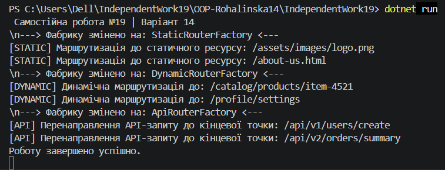

# Самостійна робота №19: Система маршрутизації (Варіант 14)

Цей проєкт — це проста й гнучка система для керування маршрутами в програмі (наприклад, куди направляти запити користувача: на статичну сторінку, динамічний профіль чи до API). 

Проєкт створено для того, щоб навчитися міняти логіку програми на льоту, не переписуючи основний код.

---

## Що саме ми зробили (Простими словами)

Уявіть, що ви прийшли на великий вокзал. Там є один головний **Диспетчер** (це наш **Singleton**). Його завдання — відправляти пасажирів за правильними маршрутами. Але сам диспетчер не будує потяги й не знає тонкощів кожного маршруту. 

Замість цього він використовує **Фабрики** (це наш **Factory Method**):
1. Коли приходить команда працювати зі статичними файлами, ми даємо диспетчеру *Статичну фабрику*. Вона створює **StaticRouter**, і пасажири їдуть до картинок чи HTML-сторінок.
2. Треба обробити складне посилання на профіль користувача? Даємо диспетчеру *Динамічну фабрику*. Вона створює **DynamicRouter**.
3. Треба звернутися до сервера через код? Вмикається *API фабрика*, яка створює **ApiRouter**.

**Головна фішка:** Диспетчер залишається тим самим, його код не змінюється. Ми просто передаємо йому в руки інший "інструмент" (фабрику), і вся система миттєво починає працювати по-іншому.

---

## Як влаштований код

Програма розділена на логічні частини:
* **`Interfaces/IRouter.cs`** — загальне правило (інтерфейс) для всіх маршрутизаторів. Кожен маршрутизатор повинен вміти робити одну річ — `Route` (прокладати маршрут).
* **`Models/`** — конкретні виконавці: `StaticRouter`, `DynamicRouter`, `ApiRouter`. Вони просто виводять текст у консоль, імітуючи реальну роботу.
* **`Factories/`** — "цехи" для створення маршрутизаторів. Є головна абстрактна фабрика `RouterFactory` і три конкретні, які знають, який саме роутер треба створити.
* **`Services/RoutingService.cs`** — той самий єдиний **Диспетчер (Singleton)**. До нього можна звернутися з будь-якої точки програми через `RoutingService.Instance`. Він тримає в собі поточну фабрику і дає їй команду працювати.
* **`Program.cs`** — точка запуску, де ми тестуємо систему: створюємо Диспетчера, по черзі міняємо йому фабрики та дивимося на результат у консолі.

---

## Контрольні питання та відповіді

### 1. Поясніть патерн Factory Method. Які проблеми він вирішує?
* **Простими словами:** Це коли клас не створює об'єкти напряму через `new`, а делегує це спеціальному методу (фабриці).
* **Що вирішує:** Прибирає жорстку залежність. Якщо завтра нам знадобиться новий `GraphQLRouter`, нам не доведеться переписувати головний сервіс програми. Ми просто створимо для нього нову фабрику. Старий код не зламається (дотримується принцип Open/Closed — код відкритий для розширення, але закритий для змін).

### 2. Поясніть патерн Singleton. Коли його доцільно використовувати, а коли варто уникати?
* **Простими словами:** Це коли ми забороняємо створювати багато екземплярів одного класу. В усій програмі може існувати лише ОДИН такий об'єкт.
* **Коли потрібен:** Для центральних "менеджерів", логерів, сервісів конфігурації або баз даних, де один об'єкт має контролювати спільний ресурс, щоб не було хаосу.
* **Коли уникати:** Не треба пхати його всюди. Singleton створює глобальну точку доступу, що схоже на "глобальні змінні". Через це код стає заплутаним, а ще його дуже важко тестувати (юніт-тести не люблять спільні об'єкти, які важко ізолювати один від одного).

### 3. Як ці два патерни можуть працювати разом для створення гнучкої та контрольованої системи?
* **Відповідь:** Вони ідеально доповнюють один одного. **Singleton** дає нам стабільність і контроль — ми маємо один чіткий сервіс управління (`RoutingService`). А **Factory Method** дає цьому сервісу гнучкість. Завдяки фабриці наш єдиний сервіс не прив'язаний до конкретних деталей. Ми можемо "на льоту" міняти фабрики всередині Singleton-об'єкта, повністю змінюючи поведінку програми без створення нових менеджерів.

### 4. Які переваги дає використання абстракцій (інтерфейсів) у поєднанні з Factory Method та Singleton?
* **Відповідь:** Це основа принципу інверсії залежностей (DIP). Наш Singleton-сервіс знає лише про інтерфейс `IRouter` і абстрактну `RouterFactory`. Він поняття не має, які саме класи існують під капотом (Static, Dynamic тощо). 
* **Переваги:** 1. **Слабка зв'язність (Loose Coupling):** Компоненти програми незалежні, як блоки Lego.
  2. **Легкість розширення:** Нові функції додаються окремими класами, не чіпаючи старі.
  3. **Тестованість:** У тестах замість справжнього роутера можна легко підставити "іграшковий" (Mock-об'єкт) і перевірити роботу сервісу за мілісекунди.

## Скрін виконаної роботи 
